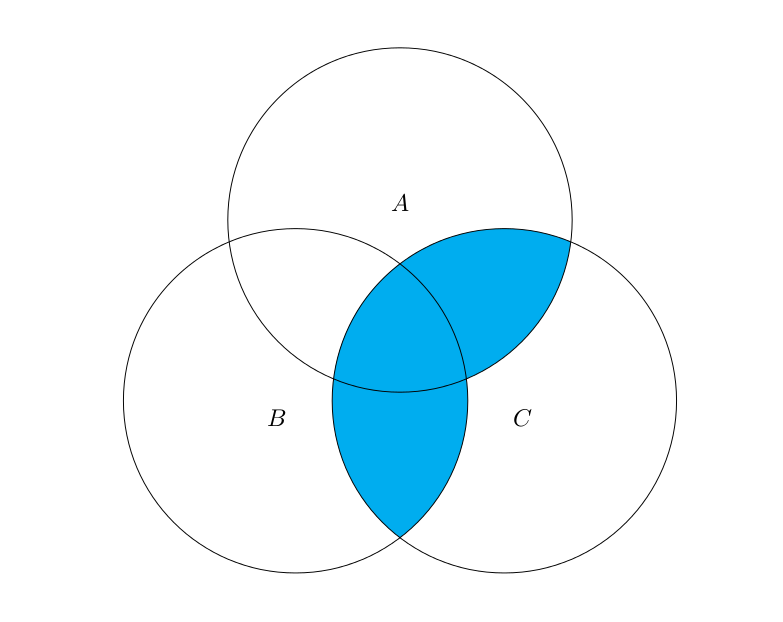
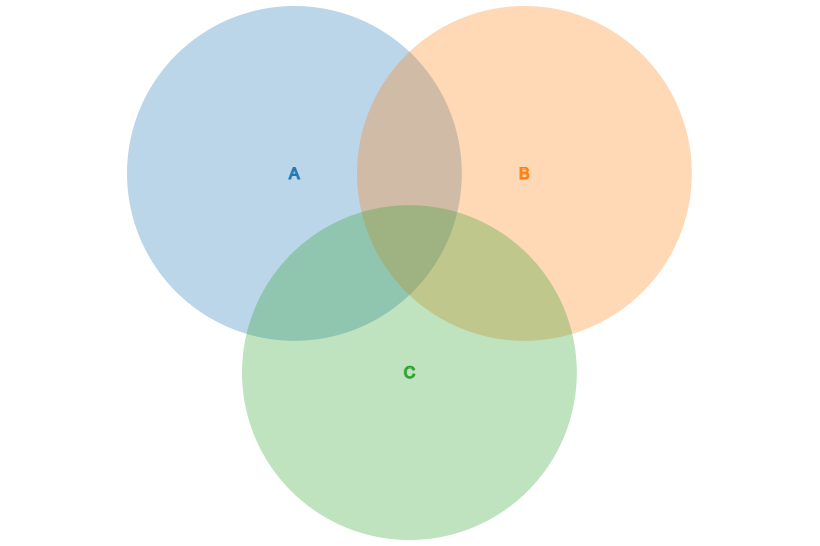

# Sets

When we want to group or categorize items or find out if there is at least one of a particular item/category, the ideal data structure for the job is the set. Sets are data structures for which order does not matter and duplicates are not allowed. This is because of set hashing, which allows sets to be extremely efficient data structures for membership testing.

This tutorial will not go into depth on set hashing. However, to give the reader a brief introduction, hashing involves each value in the set being assigned a unique numerical value, called a hash value. This allows each item in the set to be found in O(1) time.

Another useful characteristic of sets is their ability to perform set operations, such as union, intersection, and difference. Venn diagrams are very useful for visualizing set operations. In the Venn diagram below, the highlighted area is the union of the intersection of A and C and the intersection of B and C:



In Python, we can use sets to perform these operations.

## Intersection, Union, and Difference of Sets

To demonstrate how we can use Python to perform set operations, we will create sets A, B, and C that will show the results of the highlighted section of the Venn diagram above. First, to create a set in Python we use curly braces. We will create a set containing one item:

```python
A = {'banana'}
```

Now we can add some items to our list using the `.add()` set function:

```python
A.add('lemon')
A.add('canary')
A.add('umbrella')
A.add('star')
```

Next, let's create sets B and C (we will skip using the `.add()` function this time):

```python
B = {'banana', 'Bob', 'ant', 1, True, 'hello world', 'star'}
C = {'banana', 5, 6.3, False, 'canary'}
```

We now have three sets, and we can perform some set operations using them. There are two ways we can perform set operations in Python. We can use built-in set methods, or we can use |, &, and -.

```python
# Common Python Set Operations
# ---------------------

# Set intersection
A.intersection(B)
A & B

# Set union
A.union(B)
A | B

# Set difference 
A.difference(B) # Note that this is not the same as B.difference(A)
A - B # Note that this is not the same as B - A
```

To find the highlighted section of the Venn diagram above, we must find the union of the intersection of A and C and the intersection of B and C.

```python

print((A & C) | (B & C)) # {'Bob', 'lemon', 'banana'}

```

## Sets VS. Lists VS. Tuples in Python

The following table shows a brief summary of the key similarities and differences between Python sets, lists, and tuples:

 X                 | Sets | Lists | Tuples 
 ----------------- | :--: | :---: | :----: 
 **Mutability**    | Yes* | Yes   | No 
 **Duplicates**    | No   | Yes   | Yes 
 **Order Matters** | No   | Yes   | Yes 
 **Subscriptable** | No   | Yes   | Yes 
 **Notation**      | {}   | []    | () 

\*Note: Set items can be added or removed but cannot themselves be changed.

## Set Performance

Here are the performance times for the main set methods in Python:

 * `add` - O(1) performance to hash the value*
 * `remove` - O(1) performance to hash the value*
 * `member` - O(1) performance to hash the value*
 * `size` - O(1) performance to check the size of a queue

\*Note: This performance assumes good conflict resolution when hashing the values in the set.

## Example - Favorite Fruits

Imagine you are preparing for a road trip with your friend, and you both want to bring fruits as healthy snacks. You have two list - one of his favorite fruits and one of your favorite fruits - and you want to make a list of both of your favorite fruits without duplicates. You also want to know what fruits you both like so that you can make a fruit salad.

```python
your_favorite_fruits = {'banana', 'apple', 'papaya', 'grape', 'watermelon', 'strawberry', 'pear'}
your_friends_favorite_fruits = {'apple', 'tangerine', 'papaya', 'banana', 'orange'}

combined_favorite_fruits = your_favorite_fruits | your_friends_favorite_fruits
fruit_salad = your_favorite_fruits &your_friends_favorite_fruits

print("Combined list of fruits:", combined_favorite_fruits)
print("Ingredients for fruit salad:",fruit_salad)
```
Here are the results when we run the above:
```
Combined list of fruits: {'watermelon', 'strawberry', 'apple', 'orange', 'pear', 'papaya', 'tangerine', 'grape', 'banana'}
Ingredients for fruit salad: {'apple', 'papaya', 'banana'}
```

## Problem to Solve : Finding Sets of Foods According to Ingredients

There are three sets of foods:

The first set contains flour, pasta, batter, and pancakes.
The second set contains egg, pasta, omelette, and pancakes.
The third set contains milk, batter, omelette, and pancakes.

Using set operations, complete the following tasks:
* show the unique items in each of these sets (label these ingredients)
* show the food(s) that are gluten-free (i.e., no flour)
* show the food(s) that are lactose-free (i.e., no milk)
* show the food(s) that are have flour or milk or both
* show the food(s) that are common to all of these sets

The example output of the program is shown below:
```
Ingredients: {'milk', 'flour', 'egg'}
Gluten-free: {'omelette', 'milk', 'egg'}
Lactose-free: {'flour', 'pasta', 'egg'}
Flour/Milk: {'omelette', 'pancakes', 'batter', 'pasta', 'flour', 'milk'}
Food(s) common to all sets: {'pancakes'}
```

Here is a Venn diagram if it helps to visualize this problem. You can assign A to be flour, B to be eggs, and C to be milk (or vice versa).



You can check your code with the solution here: [Solution](sets_of_foods.py)

[Back to Welcome Page](0-welcome.md)