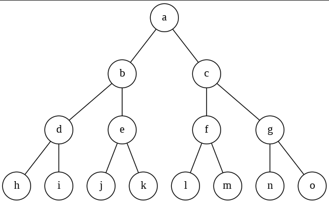

# Trees

Have you ever played chess, checkers, or even tic-tac-toe? Perhaps you have not played one of these games, but these games are not the only ones that involve decisions that branch off to different situations (the final situation of which is typically win, lose, or tie). When we speak of decisions that link to a previous decision and to future decisions, we are speaking of a tree. In programming, a tree is a data structure similar to a linked list, except that each node can link to more than one node. While there are such things as undirected trees, this tutorial will focus on directed trees, which have a head (also called the root of the tree) and typically have various branches.

## Tree Structure



Above is an image of a tree. At the top, we have node `a`, which is the head of the tree and is called the root. Here are some important terms to know when talking about trees:

* `root` - the head of the tree (i.e., `a` in the above tree)
* `tree` - the root of the tree and all of the nodes connected to it (AKA its descendants)
* `subtree` - a tree that starts at a different node than the root (called a `subroot`) and includes all that node's descendants
* `level/height` - the number of edges from the current node to the root of the tree (i.e., the root is at level 0, and node `d` in the above tree is at level 2)
* `child` - a node that is a level below a connected node (AKA the parent node - the root's children in the above tree are nodes `b` and `c`)
* `parent` - a node that is a level above a connected node (AKA the child node - the parent of nodes `b` and `c` in the above tree is the root)
* `leaf` - a node with no children (in the above tree, `h`, `i`, `j`, etc.)
* `ancestor` - all of the nodes between the current node and the root (including the root itself)
* `descendant` - all of the nodes connected below the children of a node (including the children themselves)

## Traversing a Tree

Unlike other data structures, such as a linked list, which can only be traversed more or less linearly (from node to node to node...), trees have added complexity because one node can attach to many children nodes. When we talk about tree traversal, we are specifically referring to visiting every node in a tree. There are a variety of ways to perform tree traversal, but we will discuss two in this tutorial: Depth-First Search (DFS) and Breadth-First Search. These means of tree traversal are essential algorithms for all programmers to understand.

### Depth-First Search (DFS)

Depth-First Search in a nutshell is an algorithm that involves starting at the root and traversing down a tree's branch as far as possible (i.e., until the branch ends in a leaf) before returning to traverse the rest of the branches one by one. This is done by using a recursive algorithm that adds each branch to the stack to be handled one at a time.

One example of a DFS of the above [tree](#tree-structure) is visiting the nodes in this order:
* `a`, `b`, `d`, `h`, `i`, `e`, `j`, `k`, `c`, `f`, `l`, `m`, `g`, `n`, `o`

### Breadth-First Search (BFS)

Breadth-First Search is an algorithm for tree traversal that involves traversing a tree level by level, starting at the root and ending at the leaves. This is done by visiting each node and adding its children to a queue before visiting the next node.

One example of a BFS of the above [tree](#tree-structure) is visiting the nodes in this order:
* `a`, `b`, `c`, `d`, `e`, `f`, `g`, `h`, `i`, `j`, `k`, `l`, `m`, `n`, `o`

For more in-depth information about these algorithms and other tree traversal algorithms, see this [article](https://www.geeksforgeeks.org/tree-traversals-inorder-preorder-and-postorder/#).

## Tree Performance

Here are the performance times for the main tree methods in Python:

* `insert` - O(log n) performance to insert an item into the tree
* `contains` - O(log n) performance to search the tree for an item
* `remove` - O(log n) performance to search the tree for an item and remove it
* `traverse` - O(n) performance to traverse the entire tree
* `height` - O(n) performance to check the height of all branches and return the tallest
* `size` - O(1) performance to check the size of a tree
* `empty` - O(1) performance to check the size of a tree (either by checking the root node's existence or by checking `size == 0`)

## Example - Breadth-First Search

Here is an example of a program that performs a simple Breadth-First Search on a tree, printing the data from each node as it is visited. 

(Note: This is an *extremely* basic tree, with none of the above methods. The purpose of this example is to show BFS, not all tree methods.)

```python
import queue

class Tree:

    class Node:

        def __init__(self, data, children):
            self.data = data
            self.children = children

        def __str__(self):
            return self.data + ', '
    
    def __init__(self):
        self.root = Tree.Node('a', [Tree.Node("b", [Tree.Node("d", []), Tree.Node("e", [])]), Tree.Node("c", [Tree.Node("f", []), Tree.Node("g", [])])])

    def traverse_bfs(self):
        bfs_q = queue.Queue()

        bfs_q.put(self.root)

        while not bfs_q.empty():
            next_node = bfs_q.get()
            print(next_node, end='')

            for child in next_node.children:
                bfs_q.put(child)


tree = Tree()
tree.traverse_bfs()
```
Here are the results when we run the above (notice that the nodes are visited in the same order as specified [above](#breadth-first-search-bfs) for BFS):
```
a, b, c, d, e, f, g,
```

## Problem to Solve : Depth-First Search

Now it's your turn! Create a program that performs a simple Depth-First Search on a tree, printing the data from each node as it is visited. 

Hint: Remember that DFS is a recursive algorithm.

(You can use the [BFS](#example---breadth-first-search) example program above as a starting place.)

An example execution of the program is shown below (notice that the nodes are visited in the same order as specified [above](#depth-first-search-dfs) for DFS, just with less nodes):
```
a, b, d, e, c, f, g,
```

You can check your code with the solution here: [Solution](dfs_traversal.py)

[Back to Welcome Page](0-welcome.md)